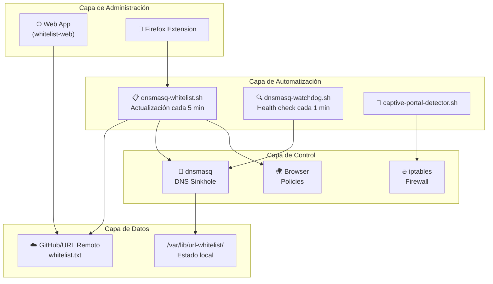
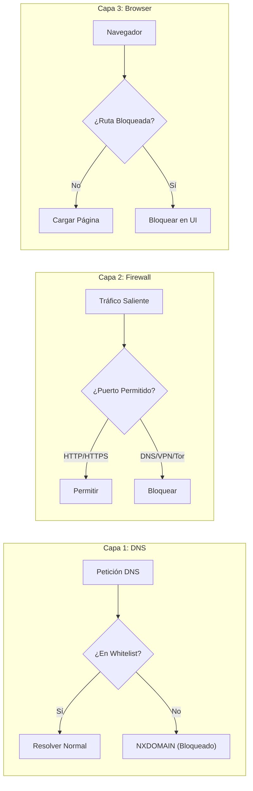
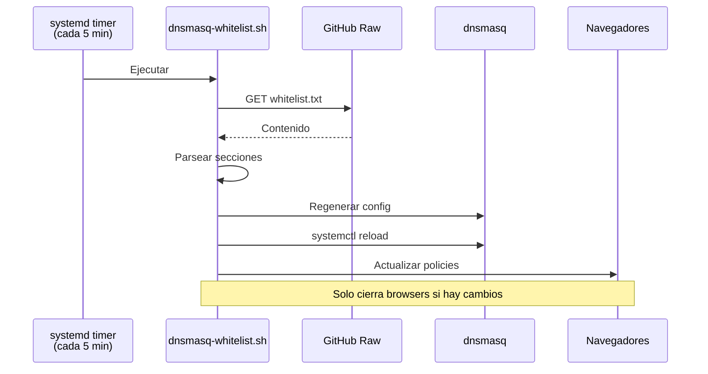
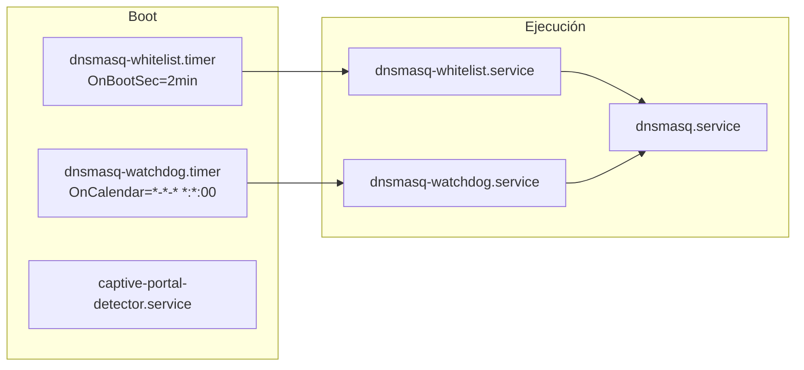
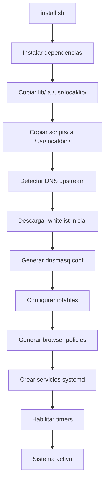
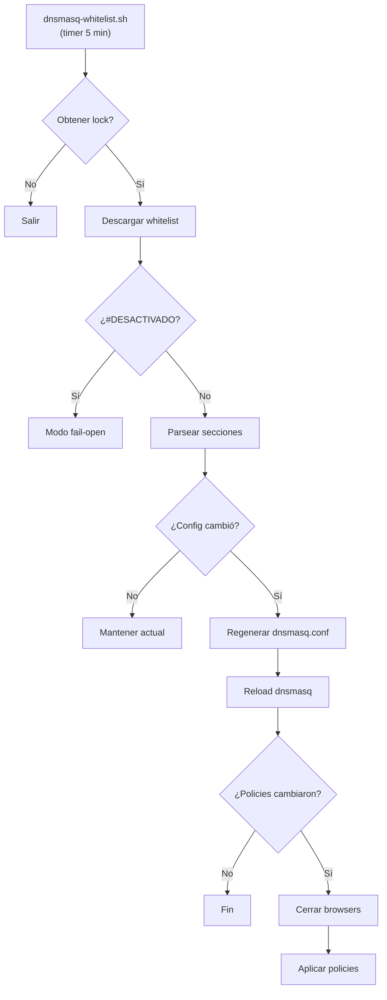
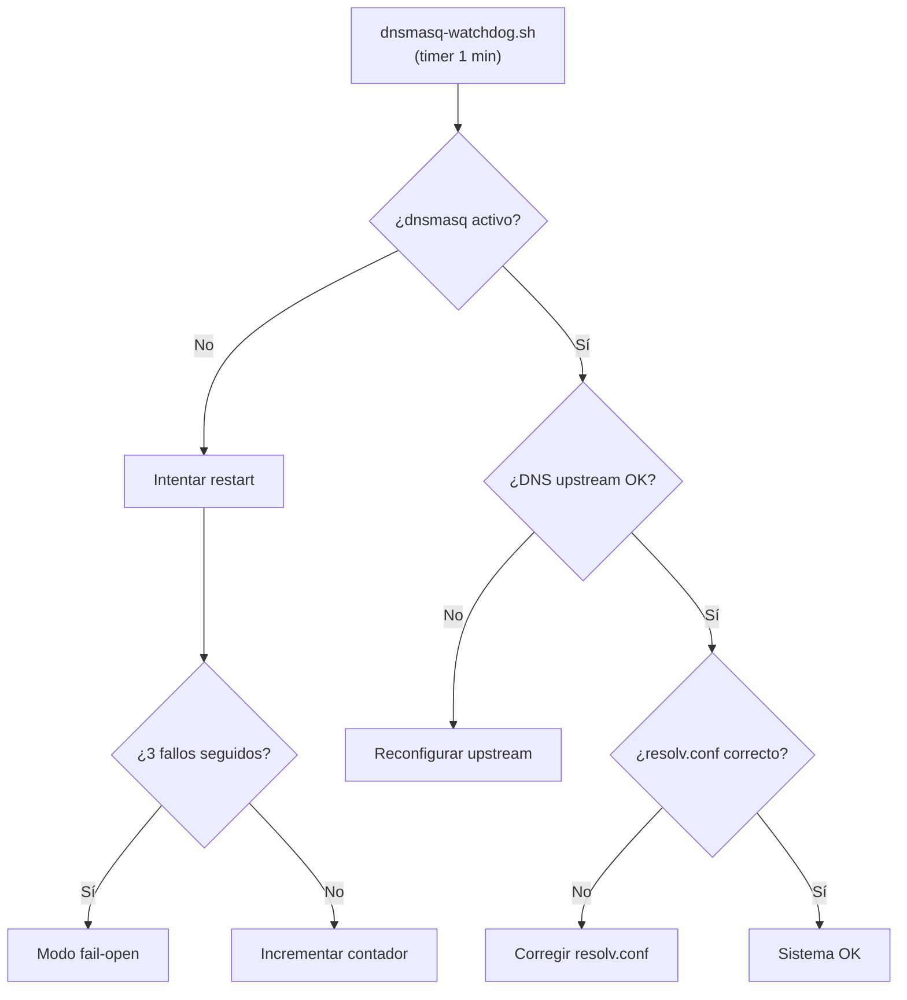

# ADR: Sistema de Whitelist DNS

**Fecha**: 2025-12-21  
**Estado**: Implementado  
**Versión del Sistema**: 3.7

---

## Resumen Ejecutivo

Sistema integral de control de acceso a internet diseñado para entornos educativos. Utiliza un enfoque de "denegación por defecto" donde todo el tráfico DNS se bloquea excepto los dominios explícitamente permitidos (whitelist).



---

## Contexto y Problema

### Problema
En entornos educativos (aulas de informática), es necesario restringir el acceso a internet para evitar distracciones y contenido inapropiado, permitiendo solo recursos educativos específicos.

### Restricciones
- Los estudiantes tienen acceso físico a las máquinas
- Deben poder usar navegadores web para recursos educativos
- La administración debe ser centralizada y remota
- El sistema debe auto-recuperarse de fallos

---

## Decisiones Arquitectónicas

### ADR-001: DNS Sinkhole como Mecanismo Principal

**Decisión**: Usar `dnsmasq` como DNS sinkhole que bloquea todos los dominios por defecto (`address=/#/`) y solo permite dominios whitelisteados (`server=/domain.com/upstream`).

**Alternativas Consideradas**:
| Alternativa | Pros | Contras |
|-------------|------|---------|
| Proxy HTTP (Squid) | Control granular URLs | Computacionalmente costoso, bypass por HTTPS |
| Pi-hole | Solución completa | Orientado a blocklist, no whitelist |
| Firewall puro | Simple | No inspecciona DNS, bypass por IP |
| DNS Sinkhole ✓ | Ligero, efectivo, difícil bypass | Requiere capas adicionales |

**Consecuencias**:
- ✅ Bajo consumo de recursos
- ✅ Cobertura total del sistema
- ⚠️ Requiere capas adicionales (firewall, browser policies)

---

### ADR-002: Arquitectura de Protección Multi-Capa

**Decisión**: Implementar tres capas de protección independientes.



#### Capa 1: DNS (`lib/dns.sh`)
- Bloquea resolución de dominios no permitidos
- Vulnerabilidad: Bypass por IP directa

#### Capa 2: Firewall (`lib/firewall.sh`)
- Bloquea puertos: 53 (DNS externo), 853 (DoT), VPN, Tor
- Permite: HTTP/HTTPS, ICMP, NTP, DHCP, LAN
- Vulnerabilidad: IPs hardcodeadas

#### Capa 3: Browser (`lib/browser.sh`)
- Firefox: `policies.json` con `WebsiteFilter`
- Chromium: `URLBlocklist` en managed policies
- Bloquea rutas específicas (`/ads/`, `/tracking/`)

---

### ADR-003: Fail-Open vs Fail-Closed

**Decisión**: El sistema **fail-open** (modo permisivo en fallos).

**Justificación**: En un entorno educativo, es peor perder conectividad (clases no pueden continuar) que permitir acceso temporal.

**Implementación**:
| Escenario | Comportamiento |
|-----------|----------------|
| Fallo descarga whitelist | Usar última whitelist local |
| dnsmasq falla 3 veces | Desactivar firewall |
| Portal cautivo detectado | Desactivar firewall temporalmente |
| Marcador `#DESACTIVADO` | Modo completamente permisivo |

---

### ADR-004: Arquitectura Modular con Bibliotecas Shell

**Decisión**: Separar funcionalidad en módulos reutilizables en `lib/`.

```
lib/
├── common.sh    # Variables globales, logging, parsing
├── dns.sh       # Configuración dnsmasq
├── firewall.sh  # Reglas iptables
├── browser.sh   # Políticas navegadores
└── services.sh  # Gestión systemd
```

**Beneficios**:
- Código testeable por módulo
- Reutilización entre scripts
- Mantenimiento simplificado

---

### ADR-005: Gestión Centralizada vía URL Remota

**Decisión**: La whitelist se descarga desde una URL configurable (por defecto GitHub).



**Formato de Whitelist**:
```
## WHITELIST
google.com
github.com

## BLOCKED-SUBDOMAINS
ads.google.com

## BLOCKED-PATHS
*/tracking/*
```

---

### ADR-006: Extensión Firefox para Diagnóstico

**Decisión**: Desarrollar extensión nativa para identificar dominios bloqueados.

**Problema Resuelto**: Los usuarios no saben qué dominios faltan en la whitelist cuando una página no carga correctamente.

**Arquitectura**:
```
firefox-extension/
├── manifest.json       # Manifest V2
├── background.js       # Escucha webRequest.onErrorOccurred
├── popup/              # UI para listar dominios bloqueados
└── native/             # Native Messaging → whitelist-cmd.sh
```

**Flujo**:
1. Usuario navega a `ejemplo.com`
2. Página carga recursos de `cdn.tercero.com` (no whitelisteado)
3. dnsmasq devuelve NXDOMAIN
4. Firefox dispara `NS_ERROR_UNKNOWN_HOST`
5. Extensión captura y muestra en badge "1"
6. Usuario abre popup y ve dominios faltantes

---

### ADR-007: Aplicación Web para Administración

**Decisión**: Reemplazar edición manual de archivos en GitHub por interfaz web.

**Stack Tecnológico**:
| Componente | Tecnología |
|------------|------------|
| Backend | Node.js + Express |
| Frontend | HTML + CSS + JavaScript vanilla |
| Almacenamiento | JSON file-based |
| Autenticación | JWT con bcrypt |
| Despliegue | Docker |

**Arquitectura**:
```
whitelist-web/
├── server/
│   ├── index.js    # API REST: /api/groups, /api/rules, /api/auth
│   └── db.js       # Operaciones CRUD sobre JSON
├── public/
│   ├── index.html  # Dashboard
│   ├── css/        # Estilos
│   └── js/         # Lógica cliente
├── data/           # Almacenamiento JSON
├── Dockerfile
└── docker-compose.yml
```

**Endpoints API**:
- `POST /api/auth/login` - Autenticación
- `GET /api/groups` - Listar grupos de reglas
- `GET /api/rules/:group` - Reglas por grupo
- `POST /api/rules` - Crear regla
- `DELETE /api/rules/:id` - Eliminar regla
- `GET /api/export/:group` - Exportar formato compatible

---

### ADR-008: API de Solicitudes de Dominios

**Decisión**: Implementar API REST en servidor local para que los usuarios puedan solicitar nuevos dominios directamente desde la extensión de Firefox.

**Stack Tecnológico**:
| Componente | Tecnología |
|------------|------------|
| Backend | Node.js + Express |
| Base de datos | SQLite |
| Autenticación | API key compartida |
| Despliegue | Servidor local (home server) |

**Arquitectura**:
```
whitelist-request-api/
├── routes/
│   └── requests.js     # Endpoints de solicitudes
├── middleware/
│   └── auth.js         # Validación API key
├── db/
│   └── database.sqlite # Base de datos SQLite
├── server.js           # Punto de entrada
└── Dockerfile          # Containerización
```

**Endpoints API**:
- `POST /api/request` - Solicitar nuevo dominio
- `GET /api/requests` - Listar solicitudes pendientes
- `POST /api/approve/:id` - Aprobar solicitud
- `POST /api/reject/:id` - Rechazar solicitud
- `GET /health` - Health check

**Integración con Firefox Extension**:
La extensión detecta dominios bloqueados y permite al usuario solicitar su inclusión en la whitelist. Las solicitudes se envían a esta API para revisión por el administrador.

---

## Componentes del Sistema

### Resumen de Componentes

| Componente | Ubicación | Propósito |
|------------|-----------|-----------|
| `install.sh` | Raíz | Instalación completa del sistema |
| `uninstall.sh` | Raíz | Desinstalación limpia |
| `lib/*.sh` | `/usr/local/lib/whitelist-system/lib/` | Módulos de funcionalidad |
| `dnsmasq-whitelist.sh` | `/usr/local/bin/` | Actualización periódica |
| `dnsmasq-watchdog.sh` | `/usr/local/bin/` | Monitoreo de salud |
| `captive-portal-detector.sh` | `/usr/local/bin/` | Detección WiFi portales |
| `whitelist-cmd.sh` | `/usr/local/bin/whitelist` | CLI para usuarios |
| Firefox Extension | `firefox-extension/` | Diagnóstico de bloqueos |
| Web App | `whitelist-web/` | Administración centralizada |
| Request API | `whitelist-request-api/` | API para solicitudes de dominios |
| Static SPA | `whitelist-web-static/` | SPA en GitHub Pages |
| OAuth Worker | `oauth-worker/` | Backend OAuth para SPA |

### Servicios systemd



---

## Flujos de Datos

### Flujo de Instalación



### Flujo de Actualización (cada 5 min)



### Flujo de Health Check (cada 1 min)



---

## Seguridad

### Vectores de Ataque Mitigados

| Vector | Mitigación |
|--------|------------|
| DNS alternativo | iptables bloquea puerto 53/853 externo |
| DoH (DNS over HTTPS) | Bloqueo de dominios DoH conocidos |
| VPN | iptables bloquea puertos OpenVPN, WireGuard |
| Tor | iptables bloquea puertos Tor |
| Edición local | Archivos requieren root |

### Vulnerabilidades Conocidas

| Vulnerabilidad | Riesgo | Estado |
|----------------|--------|--------|
| IPs hardcodeadas | Medio | No mitigado |
| Dispositivos USB con Tor | Medio | Fuera de alcance |
| Live USB bypass | Alto | Requiere BIOS lock |

---

## Directorios del Sistema

```
/usr/local/lib/whitelist-system/    # Código fuente
├── lib/                            # Módulos shell
└── scripts/                        # Scripts auxiliares

/usr/local/bin/                     # Ejecutables
├── whitelist                       # CLI principal
├── dnsmasq-whitelist.sh
├── dnsmasq-watchdog.sh
└── captive-portal-detector.sh

/var/lib/url-whitelist/             # Estado persistente
├── whitelist.txt                   # Whitelist descargada
├── original-dns.conf               # DNS upstream detectado
├── whitelist-url.conf              # URL de whitelist
├── dnsmasq.hash                    # Hash config para cambios
└── browser-policies.hash           # Hash policies

/etc/dnsmasq.d/
└── url-whitelist.conf              # Config dnsmasq generada

/etc/firefox/policies/
└── policies.json                   # Políticas Firefox

/etc/chromium/policies/managed/
└── url-whitelist.json              # Políticas Chromium

/var/log/
└── url-whitelist.log               # Log principal
```

---

## Requisitos del Sistema

| Requisito | Detalle |
|-----------|---------|
| OS | Ubuntu 20.04+ / Debian 10+ |
| Arquitectura | x86_64 (amd64) |
| Init System | systemd |
| Acceso | root/sudo |
| Dependencias | dnsmasq, iptables, iptables-persistent, ipset, curl, libcap2-bin, dnsutils, conntrack, python3 |
| Puerto | 53 disponible (systemd-resolved deshabilitado) |

---

## Conclusión

El sistema de Whitelist DNS implementa una solución robusta de control de acceso utilizando:

1. **DNS Sinkhole** como mecanismo principal de bloqueo
2. **Protección multi-capa** (DNS + Firewall + Browser)
3. **Filosofía fail-open** para maximizar disponibilidad
4. **Administración centralizada** vía URL remota
5. **Auto-recuperación** mediante watchdog
6. **Herramientas de diagnóstico** (extensión Firefox)
7. **Interfaz de administración** (aplicación web)

Esta arquitectura proporciona un balance entre seguridad y usabilidad apropiado para entornos educativos.
