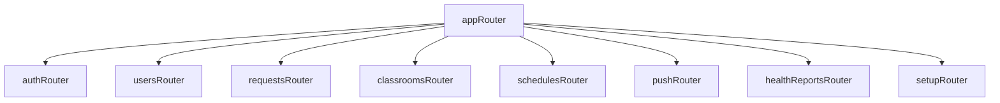
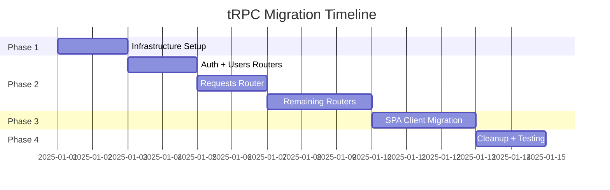

# Full tRPC Migration Plan

Complete migration from Express REST API to type-safe tRPC procedures. No compromises.

## Scope Overview

| Component | Current State | After Migration |
|-----------|--------------|-----------------|
| API Routes | 9 Express routers, ~55 endpoints | 9 tRPC routers, ~55 procedures |
| SPA Clients | 6 fetch-based API modules | Single type-safe tRPC client |
| Type Safety | Duplicated with drift | Single source of truth |
| Runtime Validation | Manual/Joi | Zod schemas |

---

## User Review Required

> [!IMPORTANT]
> This is a significant refactor affecting ~4,000 lines of API code and ~1,500 lines of SPA client code. Please confirm before proceeding.
>
> [!WARNING]
> **Breaking Changes**: The REST API endpoints will be replaced with tRPC procedures. Any external clients (mobile apps, scripts) will need migration.

---

## Phase 1: Infrastructure Setup

### Dependencies

#### [MODIFY] [package.json](file:///home/run0/whitelist/api/package.json)

```diff
  "dependencies": {
+   "@trpc/server": "^11.0.0",
+   "zod": "^3.23.0",
    ...
  }
```

#### [MODIFY] [package.json](file:///home/run0/whitelist/spa/package.json)

```diff
  "devDependencies": {
+   "@trpc/client": "^11.0.0",
+   "@openpath/shared": "workspace:*",
    ...
  }
```

---

### Shared Types Package

#### [NEW] [shared/package.json](file:///home/run0/whitelist/shared/package.json)

```json
{
  "name": "@openpath/shared",
  "version": "1.0.0",
  "type": "module",
  "main": "dist/index.js",
  "types": "dist/index.d.ts",
  "scripts": { "build": "tsc" },
  "dependencies": { "zod": "^3.23.0" }
}
```

#### [NEW] [shared/src/schemas/index.ts](file:///home/run0/whitelist/shared/src/schemas/index.ts)

Zod schemas for all API inputs/outputs:

```typescript
import { z } from 'zod';

// Domain Types
export const RequestStatus = z.enum(['pending', 'approved', 'rejected']);
export const RequestPriority = z.enum(['low', 'normal', 'high', 'urgent']);
export const UserRole = z.enum(['admin', 'teacher', 'student']);
export const MachineStatus = z.enum(['online', 'offline', 'unknown']);

// Entity Schemas
export const DomainRequest = z.object({
  id: z.string(),
  domain: z.string(),
  reason: z.string(),
  requester_email: z.string(),
  group_id: z.string(),
  priority: RequestPriority,
  status: RequestStatus,
  created_at: z.string(),
  updated_at: z.string(),
  resolved_at: z.string().nullable(),
  resolved_by: z.string().nullable(),
  resolution_note: z.string().optional(),
});

export const User = z.object({
  id: z.string(),
  email: z.string().email(),
  name: z.string(),
  isActive: z.boolean().optional(),
  emailVerified: z.boolean().optional(),
  created_at: z.string(),
  updated_at: z.string(),
});

// ... all other schemas
```

---

### tRPC Context & Base Router

#### [NEW] [api/src/trpc/context.ts](file:///home/run0/whitelist/api/src/trpc/context.ts)

```typescript
import type { CreateExpressContextOptions } from '@trpc/server/adapters/express';
import * as auth from '../lib/auth.js';
import type { DecodedWithRoles } from '../lib/auth.js';

export interface Context {
  user: DecodedWithRoles | null;
  req: CreateExpressContextOptions['req'];
  res: CreateExpressContextOptions['res'];
}

export async function createContext({ req, res }: CreateExpressContextOptions): Promise<Context> {
  const authHeader = req.headers.authorization;
  let user: DecodedWithRoles | null = null;

  if (authHeader?.startsWith('Bearer ')) {
    const token = authHeader.slice(7);
    user = await auth.verifyAccessToken(token);
    
    // Fallback to legacy admin token
    if (!user && process.env.ADMIN_TOKEN === token) {
      user = auth.createLegacyAdminPayload();
    }
  }

  return { user, req, res };
}
```

#### [NEW] [api/src/trpc/trpc.ts](file:///home/run0/whitelist/api/src/trpc/trpc.ts)

```typescript
import { initTRPC, TRPCError } from '@trpc/server';
import type { Context } from './context.js';
import * as auth from '../lib/auth.js';

const t = initTRPC.context<Context>().create();

export const router = t.router;
export const publicProcedure = t.procedure;

// Authenticated procedure middleware
export const protectedProcedure = t.procedure.use(({ ctx, next }) => {
  if (!ctx.user) {
    throw new TRPCError({ code: 'UNAUTHORIZED', message: 'Authentication required' });
  }
  return next({ ctx: { ...ctx, user: ctx.user } });
});

// Admin-only procedure middleware
export const adminProcedure = protectedProcedure.use(({ ctx, next }) => {
  if (!auth.isAdminToken(ctx.user)) {
    throw new TRPCError({ code: 'FORBIDDEN', message: 'Admin access required' });
  }
  return next({ ctx });
});

// Teacher/Admin procedure middleware
export const teacherProcedure = protectedProcedure.use(({ ctx, next }) => {
  const roles = ctx.user.roles.map(r => r.role);
  if (!roles.includes('admin') && !roles.includes('teacher')) {
    throw new TRPCError({ code: 'FORBIDDEN', message: 'Teacher access required' });
  }
  return next({ ctx });
});
```

---

## Phase 2: Router Migration

### Router Architecture



---

### Auth Router

#### [NEW] [api/src/trpc/routers/auth.ts](file:///home/run0/whitelist/api/src/trpc/routers/auth.ts)

```typescript
import { z } from 'zod';
import { router, publicProcedure, protectedProcedure } from '../trpc.js';
import * as userStorage from '../../lib/user-storage.js';
import * as roleStorage from '../../lib/role-storage.js';
import * as auth from '../../lib/auth.js';

const loginInput = z.object({
  email: z.string().email(),
  password: z.string().min(8),
});

const registerInput = z.object({
  email: z.string().email(),
  name: z.string().min(1),
  password: z.string().min(8),
});

export const authRouter = router({
  register: publicProcedure
    .input(registerInput)
    .mutation(async ({ input }) => {
      if (userStorage.emailExists(input.email)) {
        throw new TRPCError({ code: 'CONFLICT', message: 'Email already registered' });
      }
      const user = await userStorage.createUser(input);
      return { user: { id: user.id, email: user.email, name: user.name } };
    }),

  login: publicProcedure
    .input(loginInput)
    .mutation(async ({ input }) => {
      const user = await userStorage.verifyPasswordByEmail(input.email, input.password);
      if (!user) throw new TRPCError({ code: 'UNAUTHORIZED', message: 'Invalid credentials' });
      if (!user.isActive) throw new TRPCError({ code: 'FORBIDDEN', message: 'Account inactive' });
      
      const roles = roleStorage.getUserRoles(user.id);
      if (roles.length === 0) throw new TRPCError({ code: 'FORBIDDEN', message: 'No role assigned' });
      
      const tokens = auth.generateTokens(user, roles);
      return { ...tokens, user: { id: user.id, email: user.email, name: user.name, roles } };
    }),

  refresh: publicProcedure
    .input(z.object({ refreshToken: z.string() }))
    .mutation(async ({ input }) => {
      const decoded = await auth.verifyRefreshToken(input.refreshToken);
      if (!decoded) throw new TRPCError({ code: 'UNAUTHORIZED', message: 'Invalid refresh token' });
      
      const user = userStorage.getUserById(decoded.sub);
      if (!user?.isActive) throw new TRPCError({ code: 'UNAUTHORIZED', message: 'User not found' });
      
      await auth.blacklistToken(input.refreshToken);
      const roles = roleStorage.getUserRoles(user.id);
      return auth.generateTokens(user, roles);
    }),

  logout: protectedProcedure
    .input(z.object({ refreshToken: z.string().optional() }))
    .mutation(async ({ input, ctx }) => {
      const accessToken = ctx.req.headers.authorization?.slice(7);
      if (accessToken) await auth.blacklistToken(accessToken);
      if (input.refreshToken) await auth.blacklistToken(input.refreshToken);
      return { success: true };
    }),

  me: protectedProcedure.query(({ ctx }) => {
    const user = userStorage.getUserById(ctx.user.sub);
    if (!user) throw new TRPCError({ code: 'NOT_FOUND', message: 'User not found' });
    const roles = roleStorage.getUserRoles(user.id);
    return { user: { ...user, roles } };
  }),
});
```

---

### Users Router

#### [NEW] [api/src/trpc/routers/users.ts](file:///home/run0/whitelist/api/src/trpc/routers/users.ts)

```typescript
import { z } from 'zod';
import { router, adminProcedure } from '../trpc.js';
import { UserRole } from '@openpath/shared';
import * as userStorage from '../../lib/user-storage.js';
import * as roleStorage from '../../lib/role-storage.js';

export const usersRouter = router({
  list: adminProcedure.query(() => {
    const users = userStorage.getAllUsers();
    return users.map(u => ({ ...u, roles: roleStorage.getUserRoles(u.id) }));
  }),

  get: adminProcedure
    .input(z.object({ id: z.string() }))
    .query(({ input }) => {
      const user = userStorage.getUserById(input.id);
      if (!user) throw new TRPCError({ code: 'NOT_FOUND' });
      return { ...user, roles: roleStorage.getUserRoles(user.id) };
    }),

  create: adminProcedure
    .input(z.object({
      email: z.string().email(),
      name: z.string(),
      password: z.string().min(8),
      role: UserRole.optional(),
      groupIds: z.array(z.string()).optional(),
    }))
    .mutation(async ({ input, ctx }) => {
      if (userStorage.emailExists(input.email)) {
        throw new TRPCError({ code: 'CONFLICT', message: 'Email exists' });
      }
      const user = await userStorage.createUser(input);
      if (input.role) {
        roleStorage.assignRole({
          userId: user.id,
          role: input.role,
          groups: input.groupIds ?? [],
          createdBy: ctx.user.sub,
        });
      }
      return { ...user, roles: roleStorage.getUserRoles(user.id) };
    }),

  update: adminProcedure
    .input(z.object({
      id: z.string(),
      name: z.string().optional(),
      email: z.string().email().optional(),
      isActive: z.boolean().optional(),
      password: z.string().min(8).optional(),
    }))
    .mutation(async ({ input }) => {
      const { id, ...updates } = input;
      const updated = await userStorage.updateUser(id, updates);
      if (!updated) throw new TRPCError({ code: 'NOT_FOUND' });
      return { ...updated, roles: roleStorage.getUserRoles(id) };
    }),

  delete: adminProcedure
    .input(z.object({ id: z.string() }))
    .mutation(({ input, ctx }) => {
      if (ctx.user.sub === input.id) {
        throw new TRPCError({ code: 'BAD_REQUEST', message: 'Cannot delete yourself' });
      }
      roleStorage.revokeAllUserRoles(input.id, ctx.user.sub);
      userStorage.deleteUser(input.id);
      return { success: true };
    }),

  // Role management
  assignRole: adminProcedure
    .input(z.object({
      userId: z.string(),
      role: UserRole,
      groupIds: z.array(z.string()).default([]),
    }))
    .mutation(({ input, ctx }) => {
      return roleStorage.assignRole({
        userId: input.userId,
        role: input.role,
        groups: input.groupIds,
        createdBy: ctx.user.sub,
      });
    }),

  revokeRole: adminProcedure
    .input(z.object({ userId: z.string(), roleId: z.string() }))
    .mutation(({ input, ctx }) => {
      roleStorage.revokeRole(input.roleId, ctx.user.sub);
      return { success: true };
    }),

  listTeachers: adminProcedure.query(() => roleStorage.getAllTeachers()),
});
```

---

### Requests Router

#### [NEW] [api/src/trpc/routers/requests.ts](file:///home/run0/whitelist/api/src/trpc/routers/requests.ts)

```typescript
import { z } from 'zod';
import { router, publicProcedure, protectedProcedure, teacherProcedure } from '../trpc.js';
import { RequestStatus, RequestPriority } from '@openpath/shared';
import * as storage from '../../lib/storage.js';
import * as github from '../../lib/github.js';
import * as push from '../../lib/push.js';
import * as auth from '../../lib/auth.js';

export const requestsRouter = router({
  // Public: Create request
  create: publicProcedure
    .input(z.object({
      domain: z.string().regex(/^(?:[a-zA-Z0-9](?:[a-zA-Z0-9-]{0,61}[a-zA-Z0-9])?\.)+[a-zA-Z]{2,}$/),
      reason: z.string().optional(),
      requester_email: z.string().email().optional(),
      group_id: z.string().optional(),
      priority: RequestPriority.optional(),
    }))
    .mutation(async ({ input }) => {
      if (storage.hasPendingRequest(input.domain)) {
        throw new TRPCError({ code: 'CONFLICT', message: 'Pending request exists' });
      }
      const request = storage.createRequest({
        domain: input.domain.toLowerCase(),
        reason: input.reason ?? 'No reason provided',
        requesterEmail: input.requester_email,
        groupId: input.group_id,
        priority: input.priority,
      });
      push.notifyTeachersOfNewRequest(request).catch(console.error);
      return request;
    }),

  // Public: Get status
  getStatus: publicProcedure
    .input(z.object({ id: z.string() }))
    .query(({ input }) => {
      const request = storage.getRequestById(input.id);
      if (!request) throw new TRPCError({ code: 'NOT_FOUND' });
      return { id: request.id, domain: request.domain, status: request.status };
    }),

  // Protected: List requests (filtered by user's groups)
  list: protectedProcedure
    .input(z.object({ status: RequestStatus.optional() }))
    .query(({ input, ctx }) => {
      let requests = storage.getAllRequests(input.status ?? null);
      const groups = auth.getApprovalGroups(ctx.user);
      if (groups !== 'all') {
        requests = requests.filter(r => groups.includes(r.group_id));
      }
      return requests;
    }),

  // Teacher+: Approve
  approve: teacherProcedure
    .input(z.object({ id: z.string(), group_id: z.string().optional() }))
    .mutation(async ({ input, ctx }) => {
      const request = storage.getRequestById(input.id);
      if (!request) throw new TRPCError({ code: 'NOT_FOUND' });
      if (request.status !== 'pending') {
        throw new TRPCError({ code: 'BAD_REQUEST', message: `Already ${request.status}` });
      }
      
      const targetGroup = input.group_id ?? request.group_id;
      if (!auth.canApproveGroup(ctx.user, targetGroup)) {
        throw new TRPCError({ code: 'FORBIDDEN', message: 'Cannot approve for this group' });
      }

      // Check blocked domains for non-admins
      if (!auth.isAdminToken(ctx.user)) {
        const blocked = await github.isDomainBlocked(request.domain);
        if (blocked.blocked) {
          throw new TRPCError({ code: 'FORBIDDEN', message: 'Domain is blocked' });
        }
      }

      await github.addDomainToWhitelist(request.domain, targetGroup);
      return storage.updateRequestStatus(request.id, 'approved', ctx.user.name ?? ctx.user.email, `Added to ${targetGroup}`);
    }),

  // Teacher+: Reject
  reject: teacherProcedure
    .input(z.object({ id: z.string(), reason: z.string().optional() }))
    .mutation(({ input, ctx }) => {
      const request = storage.getRequestById(input.id);
      if (!request) throw new TRPCError({ code: 'NOT_FOUND' });
      if (request.status !== 'pending') {
        throw new TRPCError({ code: 'BAD_REQUEST', message: `Already ${request.status}` });
      }
      return storage.updateRequestStatus(request.id, 'rejected', ctx.user.name ?? ctx.user.email, input.reason);
    }),

  // Admin: Delete
  delete: adminProcedure
    .input(z.object({ id: z.string() }))
    .mutation(({ input }) => {
      if (!storage.deleteRequest(input.id)) throw new TRPCError({ code: 'NOT_FOUND' });
      return { success: true };
    }),

  // Protected: List groups
  listGroups: protectedProcedure.query(async ({ ctx }) => {
    const allGroups = await github.listWhitelistFiles();
    const userGroups = auth.getApprovalGroups(ctx.user);
    return userGroups === 'all' ? allGroups : allGroups.filter(g => userGroups.includes(g.name));
  }),
});
```

---

### Additional Routers (Summary)

The following routers follow the same pattern:

| Router | File | Procedures |
|--------|------|------------|
| **classrooms** | `routers/classrooms.ts` | `list`, `get`, `create`, `update`, `delete`, `setActiveGroup`, `registerMachine`, `getWhitelistUrl`, `stats` |
| **schedules** | `routers/schedules.ts` | `getByClassroom`, `getMine`, `create`, `update`, `delete`, `getCurrentForClassroom` |
| **push** | `routers/push.ts` | `getVapidKey`, `getStatus`, `subscribe`, `unsubscribe` |
| **healthReports** | `routers/healthReports.ts` | `submit`, `list`, `getAlerts`, `getByHost` |
| **setup** | `routers/setup.ts` | `getStatus`, `createFirstAdmin` |

---

### App Router

#### [NEW] [api/src/trpc/routers/index.ts](file:///home/run0/whitelist/api/src/trpc/routers/index.ts)

```typescript
import { router } from '../trpc.js';
import { authRouter } from './auth.js';
import { usersRouter } from './users.js';
import { requestsRouter } from './requests.js';
import { classroomsRouter } from './classrooms.js';
import { schedulesRouter } from './schedules.js';
import { pushRouter } from './push.js';
import { healthReportsRouter } from './healthReports.js';
import { setupRouter } from './setup.js';

export const appRouter = router({
  auth: authRouter,
  users: usersRouter,
  requests: requestsRouter,
  classrooms: classroomsRouter,
  schedules: schedulesRouter,
  push: pushRouter,
  healthReports: healthReportsRouter,
  setup: setupRouter,
});

export type AppRouter = typeof appRouter;
```

---

### Express Integration

#### [MODIFY] [api/src/server.ts](file:///home/run0/whitelist/api/src/server.ts)

```diff
+ import { createExpressMiddleware } from '@trpc/server/adapters/express';
+ import { appRouter } from './trpc/routers/index.js';
+ import { createContext } from './trpc/context.js';

  // After other middleware, before 404 handler:
+ app.use('/trpc', createExpressMiddleware({
+   router: appRouter,
+   createContext,
+ }));
```

---

## Phase 3: SPA Client Migration

### tRPC Client Setup

#### [NEW] [spa/src/trpc.ts](file:///home/run0/whitelist/spa/src/trpc.ts)

```typescript
import { createTRPCClient, httpBatchLink } from '@trpc/client';
import type { AppRouter } from '@openpath/shared';

function getApiUrl(): string {
  return localStorage.getItem('requests_api_url') ?? '';
}

function getAuthHeaders(): Record<string, string> {
  const token = localStorage.getItem('access_token');
  return token ? { Authorization: `Bearer ${token}` } : {};
}

export const trpc = createTRPCClient<AppRouter>({
  links: [
    httpBatchLink({
      url: () => `${getApiUrl()}/trpc`,
      headers: getAuthHeaders,
    }),
  ],
});
```

### Migration Example: UsersAPI → trpc.users

#### Before (fetch-based)

```typescript
// spa/src/users-api.ts
async list(): Promise<APIResponse<{ users: User[] }>> {
  return this.request('/api/users');
}
```

#### After (tRPC)

```typescript
// spa/src/modules/users.ts
import { trpc } from '../trpc.js';

async function loadUsers() {
  const users = await trpc.users.list.query();  // Fully typed!
  renderUsers(users);
}
```

---

## Phase 4: Cleanup & Verification

### Files to Delete

```
api/routes/         # Old JS routes (all 8 files)
api/src/routes/     # Old TS routes (all 9 files)
spa/src/users-api.ts
spa/src/requests-api.ts
spa/src/classrooms-api.ts
spa/src/schedules-api.ts
```

### Verification Plan

```bash
# 1. Build shared package
cd shared && npm run build

# 2. Build API
cd ../api && npm run build && npm run typecheck

# 3. Build SPA
cd ../spa && npm run build && npm run typecheck

# 4. Run API tests (need to update for tRPC)
cd ../api && npm run test:all

# 5. Run E2E tests
cd ../spa && npm run test:e2e
```

---

## Migration Timeline



### Estimated Total: 14 working days
