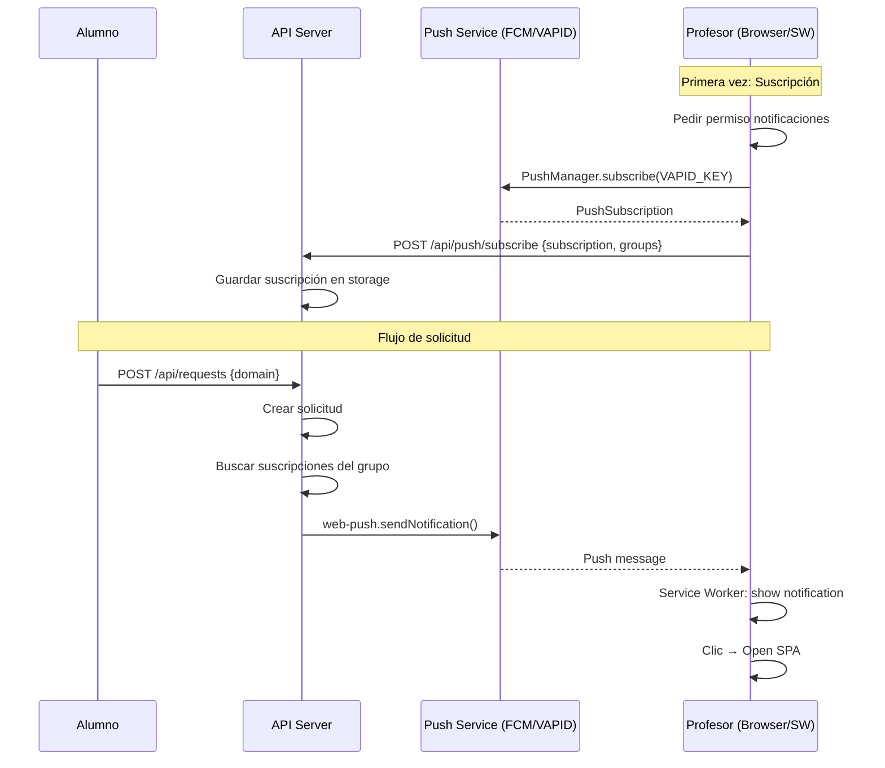

# Tres Amigos: Notificación a Profesor

## User Story

> **Como Pedro (Profesor), recibo notificación push cuando alumno solicita desbloqueo**

| Campo | Valor |
|-------|-------|
| **Epic** | Durante la Clase (Tiempo Real) |
| **Estimación** | 2 días |
| **Prioridad** | P1 (SHOULD HAVE) |
| **Sprint** | MVP K-12 - Release 1 |
| **Dependencia** | US1 - Rol Profesor, US3 - Aprobación Delegada |

---

## 👤 Perspectiva NEGOCIO (Product Owner)

### ¿Por qué es importante?

- **Tiempo real crítico**: El profesor necesita enterarse inmediatamente cuando un alumno solicita un dominio en clase
- **Flujo de trabajo móvil**: Pedro usa el móvil en clase, no tiene el SPA abierto constantemente
- **Competencia**: GoGuardian/Lightspeed envían notificaciones push a profesores

### Criterios de éxito del negocio

| Criterio | Métrica |
|----------|---------|
| Latencia notificación | <5 segundos desde solicitud |
| Tasa de apertura | >50% de notificaciones resultan en acción |
| Adopción | >80% de profesores activan notificaciones |

### Preguntas de negocio

1. **¿Pedro recibe notificaciones de TODAS las solicitudes o solo de sus grupos?**
   - 💡 Solo de los grupos que tiene asignados

2. **¿Hay horario para las notificaciones (solo horario escolar)?**
   - 💡 MVP: No. Futuro: Configuración de horario

3. **¿Qué pasa si Pedro no tiene el móvil cerca?**
   - 💡 La solicitud queda pendiente, también visible en dashboard

4. **¿Hay límite de notificaciones (anti-spam)?**
   - 💡 MVP: No. Futuro: Agrupar si >5 en 1 minuto

---

## 🧪 Perspectiva QA (Testing)

### Escenarios de prueba

#### Happy Path
```gherkin
Scenario: Pedro recibe notificación cuando alumno solicita dominio
  Given Pedro está autenticado con rol Profesor
  And Pedro tiene notificaciones push activadas
  And Pedro tiene asignado el grupo "Ciencias-3ESO"
  When un alumno del grupo "Ciencias-3ESO" solicita "youtube.com"
  Then Pedro recibe notificación push en <5 segundos
  And la notificación muestra "Nueva solicitud: youtube.com"
  And la notificación incluye botón "Ver solicitud"

Scenario: Pedro hace clic en notificación y abre dashboard
  Given Pedro recibe notificación de nueva solicitud
  When Pedro hace clic en la notificación
  Then se abre el dashboard del SPA
  And la solicitud aparece destacada para acción rápida
```

#### Edge Cases
```gherkin
Scenario: Profesor sin notificaciones activadas
  Given Pedro no ha activado las notificaciones push
  When un alumno solicita un dominio
  Then no se envía notificación push
  And la solicitud aparece en el dashboard al refrescar

Scenario: Profesor de otro grupo no recibe notificación
  Given María tiene rol Profesor para "Matemáticas-4ESO"
  And Pedro tiene rol Profesor para "Ciencias-3ESO"
  When alumno de "Ciencias-3ESO" solicita dominio
  Then solo Pedro recibe notificación
  And María no recibe notificación

Scenario: Notificación cuando SPA está cerrado (PWA)
  Given Pedro cerró el navegador
  And Pedro tiene Service Worker instalado
  When alumno solicita dominio
  Then Pedro recibe notificación del sistema operativo
  And al hacer clic, se abre el SPA

Scenario: Múltiples dispositivos del mismo profesor
  Given Pedro tiene el SPA abierto en móvil y PC
  And ambos tienen suscripción push activa
  When alumno solicita dominio
  Then Pedro recibe notificación en ambos dispositivos
```

### Checklist de pruebas

| Tipo | Descripción | Automatizado |
|------|-------------|--------------|
| Unit | Lógica envío push solo a grupos asignados | ✅ Node test |
| Integration | API registra suscripción correctamente | ✅ Supertest |
| Integration | POST /requests dispara push | ✅ Mock web-push |
| E2E | Flujo completo registro suscripción | 🟡 Playwright (parcial) |
| Manual | Notificación en móvil real | 📱 Real devices |
| Manual | Clic en notificación abre SPA | 📱 Real devices |

> [!NOTE]
> Las notificaciones push no se pueden probar completamente en E2E automatizado.
> Requiere verificación manual en dispositivo real.

---

## 💻 Perspectiva DESARROLLO (Técnico)

### Prerequisitos

- US1 - Rol Profesor (para saber a qué grupos notificar)
- US3 - Aprobación Delegada (flujo completo)

### Arquitectura de Push Notifications



### Cambios en API

| Endpoint | Método | Descripción |
|----------|--------|-------------|
| `POST /api/push/subscribe` | NEW | Registrar suscripción push |
| `DELETE /api/push/subscribe` | NEW | Eliminar suscripción |
| `GET /api/push/vapid-key` | NEW | Obtener clave pública VAPID |
| `POST /api/requests` | MODIFY | Añadir envío de push tras crear solicitud |

### Nueva dependencia

```json
{
  "dependencies": {
    "web-push": "^3.6.7"
  }
}
```

### Variables de entorno nuevas

```bash
# VAPID keys para Web Push (generadas con web-push generate-vapid-keys)
VAPID_PUBLIC_KEY=<base64_public>
VAPID_PRIVATE_KEY=<base64_private>
VAPID_SUBJECT=mailto:admin@school.edu
```

### Modelo de datos nuevo

```typescript
// Nuevo: PushSubscription storage
interface StoredPushSubscription {
  id: string;
  userId: string;           // FK a User
  groupIds: string[];       // Grupos a los que está suscrito
  subscription: {           // PushSubscription del navegador
    endpoint: string;
    keys: {
      p256dh: string;
      auth: string;
    };
  };
  userAgent: string;        // Para debug multi-dispositivo
  createdAt: Date;
}
```

### Nuevo módulo: lib/push.ts

```javascript
// lib/push.js
const webPush = require('web-push');

// Configurar VAPID
webPush.setVapidDetails(
  process.env.VAPID_SUBJECT,
  process.env.VAPID_PUBLIC_KEY,
  process.env.VAPID_PRIVATE_KEY
);

/**
 * Enviar notificación a todos los profesores de un grupo
 */
async function notifyTeachersOfNewRequest(request) {
  const subscriptions = getSubscriptionsForGroup(request.group_id);
  
  const payload = JSON.stringify({
    title: 'Nueva solicitud',
    body: `Dominio: ${request.domain}`,
    data: { 
      requestId: request.id,
      url: `/dashboard?highlight=${request.id}`
    }
  });

  const results = await Promise.allSettled(
    subscriptions.map(sub => 
      webPush.sendNotification(sub.subscription, payload)
    )
  );
  
  // Limpiar suscripciones inválidas (HTTP 410)
  results.forEach((result, i) => {
    if (result.status === 'rejected' && result.reason.statusCode === 410) {
      deleteSubscription(subscriptions[i].id);
    }
  });
}
```

### Cambios en SPA

```
spa/
├── sw.js                       # [NEW] Service Worker
├── js/
│   └── push.js                 # [NEW] Gestión push en cliente
└── index.html                  # [MODIFY] Registrar SW + botón activar
```

#### Service Worker (sw.js)

```javascript
// sw.js
self.addEventListener('push', event => {
  const data = event.data?.json() || {};
  
  event.waitUntil(
    self.registration.showNotification(data.title || 'OpenPath', {
      body: data.body,
      icon: '/icon-192.png',
      badge: '/badge.png',
      data: data.data,
      actions: [
        { action: 'view', title: 'Ver solicitud' },
        { action: 'dismiss', title: 'Descartar' }
      ]
    })
  );
});

self.addEventListener('notificationclick', event => {
  event.notification.close();
  
  if (event.action === 'view' || !event.action) {
    const url = event.notification.data?.url || '/';
    event.waitUntil(clients.openWindow(url));
  }
});
```

### UI: Botón de notificaciones

En el header del dashboard:

```html
<button id="notifications-btn" class="btn btn-ghost" title="Notificaciones">
  <span id="notifications-icon">🔔</span>
  <span id="notifications-status" class="badge hidden">OFF</span>
</button>
```

### Riesgos técnicos

| Riesgo | Probabilidad | Impacto | Mitigación |
|--------|--------------|---------|------------|
| Navegador no soporta push | Baja | Medio | Fallback a polling, detectar soporte |
| VAPID keys expiran/rotan | Baja | Alto | Documentar proceso regeneración |
| Suscripciones obsoletas | Media | Bajo | Limpiar automáticamente en HTTP 410 |
| Usuario rechaza permiso | Media | Medio | UI clara explicando beneficios |

---

## ✅ Acuerdos del Tres Amigos

### Definition of Ready
- [x] Criterios de aceptación definidos
- [x] Arquitectura push especificada
- [x] Endpoints API documentados
- [x] Service Worker diseñado
- [x] Dependencias identificadas (web-push)

### Definition of Done
- [ ] API endpoint `/api/push/subscribe` funcionando
- [ ] Service Worker registrado en SPA
- [ ] POST /requests envía notificación push
- [ ] Tests unitarios para lógica de envío
- [ ] Tests integración API push
- [ ] UI botón activar/desactivar notificaciones
- [ ] Documentación de variables entorno (.env.example)
- [ ] Code review aprobado
- [ ] Deploy en staging

### Tareas desglosadas

| # | Tarea | Estimación | Owner |
|---|-------|------------|-------|
| 1 | Añadir web-push + variables VAPID | 0.25 días | Backend |
| 2 | Crear lib/push.js | 0.25 días | Backend |
| 3 | Endpoint POST /api/push/subscribe | 0.25 días | Backend |
| 4 | Modificar POST /requests para enviar push | 0.25 días | Backend |
| 5 | Tests API push (mock web-push) | 0.25 días | Backend |
| 6 | Crear sw.js (Service Worker) | 0.25 días | Frontend |
| 7 | UI botón notificaciones + flujo permiso | 0.25 días | Frontend |
| 8 | Verificación manual en dispositivo | 0.25 días | QA |

**Total: 2 días** ✅ (coincide con estimación)

---

## 📎 Referencias

- [MVP_K12.md](file:///home/run0/whitelist/docs/MVP_K12.md) - Documento completo MVP
- [US1 - Rol Profesor](file:///home/run0/whitelist/docs/tres_amigos/01_rol_profesor.md) - Dependencia
- [US3 - Aprobación Delegada](file:///home/run0/whitelist/docs/tres_amigos/03_aprobacion_delegada.md) - Dependencia
- [Persona Pedro](file:///home/run0/whitelist/docs/MVP_K12.md#L48-56) - Profesor
- [Web Push API - MDN](https://developer.mozilla.org/en-US/docs/Web/API/Push_API)
